<table>
<tr>
<td valign="top"></td>
<td valign="top"></td>
</tr>
</table>

## ANUJ YADAV

**Nyx · AI Engineer & Full-Stack Developer · Open Source Contributor**

 

<!-- animated contribution graph, refreshed daily by the workflow -->

